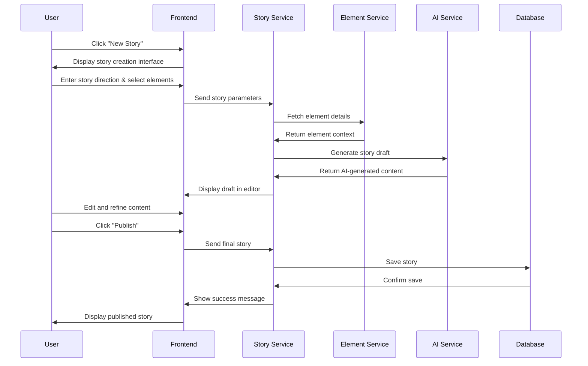

# WorldForge Epic: AI-Assisted Story Creation

## Feature Release Note
We're excited to introduce AI-Assisted Story Creation to WorldForge! This groundbreaking feature empowers writers to craft rich narratives with the help of advanced AI technology. Simply provide your creative direction, select your story elements, and let our AI help you weave compelling tales. Edit and refine the AI-generated content to match your vision perfectly. This is just the beginning of our journey to revolutionize collaborative storytelling!

### Key Features:
- Intuitive story creation interface
- AI-powered content generation based on your direction
- Integration with shared story elements (characters, items, locations)
- Rich text editing capabilities
- Story preview and publishing workflow

## User Flow


## Demo Steps (E2E Test Cases)

### 1. Story Creation Initiation
- Navigate to dashboard
- Click "New Story" button
- Verify story creation interface loads

### 2. Story Direction Input
- Enter story title "The Mountain's Secret"
- Input story direction: "A mysterious mountain cave holds an ancient artifact"
- Select genre: Fantasy
- Verify all inputs are saved

### 3. Element Selection
- Open element selector
- Select character "Mountain Guide"
- Select location "Misty Peaks"
- Select item "Ancient Map"
- Verify all elements are displayed in the sidebar

### 4. AI Generation
- Click "Generate Story"
- Verify loading state is shown
- Verify AI-generated content appears in editor
- Confirm content includes selected elements

### 5. Content Editing
- Edit first paragraph
- Add new description
- Format text (bold, italic)
- Verify all edits are preserved

### 6. Story Preview
- Click "Preview" button
- Verify formatted story display
- Check element references
- Confirm layout matches expected design

### 7. Publishing Flow
- Click "Publish" button
- Verify confirmation dialog appears
- Confirm publication
- Check story appears in public feed

## Development Tasks

### Frontend Tasks

#### 1. Create Story Editor Component
```typescript
// Unit Tests:
- Should render empty editor state
- Should accept initial content
- Should handle formatting commands
- Should maintain undo/redo history

// Integration Tests:
- Should sync content with backend
- Should handle concurrent edits
```

#### 2. Element Selector Component
```typescript
// Unit Tests:
- Should render element categories
- Should filter elements by type
- Should maintain selected elements list

// Integration Tests:
- Should fetch elements from API
- Should update story context on selection
```

#### 3. AI Generation Interface
```typescript
// Unit Tests:
- Should validate story parameters
- Should display generation progress
- Should handle error states

// Integration Tests:
- Should communicate with AI service
- Should update editor with generated content
```

#### 4. Story Preview Component
```typescript
// Unit Tests:
- Should render formatted content
- Should display element references
- Should match publication layout

// Integration Tests:
- Should load story data
- Should reflect real-time edits
```

### Backend Tasks

#### 1. Story Service Implementation
```python
# Unit Tests:
- Should create story records
- Should validate story parameters
- Should handle element associations

# Integration Tests:
- Should coordinate with AI service
- Should manage element service interactions
```

#### 2. AI Integration Service
```python
# Unit Tests:
- Should generate valid prompts
- Should process AI responses
- Should handle rate limiting

# Integration Tests:
- Should communicate with LLM API
- Should maintain context consistency
```

#### 3. Element Context Manager
```python
# Unit Tests:
- Should aggregate element data
- Should validate element relationships
- Should track element usage

# Integration Tests:
- Should update element metadata
- Should maintain referential integrity
```

#### 4. Story Storage Service
```python
# Unit Tests:
- Should persist story content
- Should handle version control
- Should manage metadata

# Integration Tests:
- Should coordinate with databases
- Should handle concurrent saves
```

### Database Tasks

#### 1. Story Schema Implementation
```sql
# Unit Tests:
- Should enforce data constraints
- Should maintain relationships
- Should handle text content

# Integration Tests:
- Should scale with content size
- Should support efficient queries
```

#### 2. Element Reference System
```sql
# Unit Tests:
- Should track element usage
- Should maintain referential integrity
- Should support version control

# Integration Tests:
- Should handle concurrent updates
- Should support complex queries
```

### DevOps Tasks

#### 1. AI Service Deployment
```yaml
# Unit Tests:
- Should validate configuration
- Should check resource allocation
- Should verify security settings

# Integration Tests:
- Should monitor performance
- Should handle scaling events
```

#### 2. Story Service Deployment
```yaml
# Unit Tests:
- Should verify service dependencies
- Should validate endpoints
- Should check logging

# Integration Tests:
- Should test load balancing
- Should verify backup systems
```

## Task Dependencies

- Frontend tasks can be worked on in parallel with backend service implementation
- Story Service must be completed before AI Integration Service
- Database schema must be implemented before Story Storage Service
- DevOps tasks should be started early but can be completed last

## Timeline Estimation

1. **Week 1-2**: Database Schema and Basic Story Service
2. **Week 2-3**: Frontend Components and AI Integration
3. **Week 3-4**: Integration and Testing
4. **Week 4**: DevOps and Deployment

## Success Metrics

- Story creation success rate > 95%
- AI generation response time < 5s
- Editor autosave success rate > 99%
- System uptime > 99.9%
- User satisfaction score > 4.5/5

## Risk Mitigation

1. **AI Service Availability**
   - Implement fallback content generation
   - Cache common prompts
   - Set up redundant API endpoints

2. **Data Consistency**
   - Implement robust transaction management
   - Set up automatic backups
   - Version all content changes

3. **Performance**
   - Implement content pagination
   - Cache frequently accessed elements
   - Set up monitoring and alerts

4. **Security**
   - Regular security audits
   - Input sanitization
   - Rate limiting on all endpoints